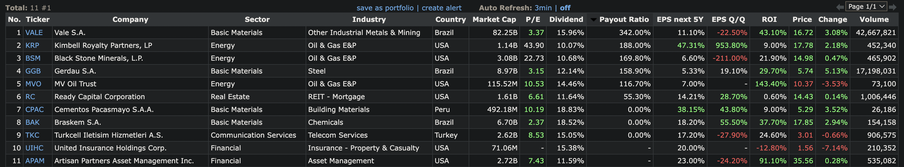

# Intro to DRIP, REITs, and Dividend Reinvesting

Recently I've been getting a lot of emails and articles for REITs and dividend returns, so I decided to do some digging.

My initial starting place was this excellent intro article from Investopedia [^1], followed by a little spelunking
around Finviz [^2].

**Outline**

* What's going on right now?
* What is a Dividend?
* How much do I pay in taxes?
* What is an MLP?
* What is a REIT?

# What's going on right now?

In the first half of 2022 the stock markets started dropping rather dramatically.  
As of May 12th, 2022 the Dow is down nearly 15% in 2022, while the Nasdaq has dropped 29% [^3].

With the recent drop in the stock markets an increasing number of investors are turning to safer investments such as
dividend paying stocks. There are a large number of stocks that have a dividend, but for this article I'll focus on
REITs since they return a higher yield but with a few trade-offs.

## What is a Dividend?

A dividend is a distribution of money or stock from a company.  
The dividend comes from the company's earnings and is typically paid out yearly, bi-annually (6mo interval), quarterly (
3mo interval), or sometimes monthly.

TL;DR [^4]

1. A dividend is the distribution of corporate profits to eligible shareholders.
2. The dividend payments and amounts are determined by a company's board of directors.
3. A dividend is a payment made by a public company to the investors (eg shareholders) for investing their money in the
   venture.
4. The announcement of a dividend payout typically is followed by a proportional increase or decrease in a company's
   stock price. For example when a $100 stock announces a $5 dividend, the share price may drop to $95.
5. Companies that don't pay a dividend keep the earnings instead, typically reinvesting it back in the company or saving
   the earnings for rainy day.

The dividend may start or stop at any time [^5], and for extra added fun there can be special one-time dividends too.

## What is DRIP?
DRIP stands for Dividend Reinvestment Plan, this is an automated way of reinvesting the dividends back into the stock [^17].

Not all companies support a DRIP, so you may need to setup an automated buy order on your own to reinvest the dividend.

## How much do I pay in taxes?

An important aspect of dividends is that they are usually are tax preferred.
What this means is that when the dividend is paid out, you pay taxes on it [^6].

### Tax rates

- The standard federal tax rate is 10-37%
- The capital gains tax rate ranges from 0%, 15, or 20% for long-term capital gains, and your ordinary income tax rate
  for short-term gains.

### Dividend Types

- Qualified dividends are taxed at the capital gains tax rate, which is typically lower than your normal tax rate above.
- Ordinary dividends are taxed at your normal tax rate above. Examples of these are MLP and REITs' discussed below.

There are a few rules to it, but the key factor is not all dividends are Qualified dividends.

- If the company is something like a MLP or REIT where the majority of the earnings is returned to you the investor,
  then it's not a Qualified dividend.
- A Qualified dividend only has favorable tax treatment if you match the holding period [^7]:

  ```You must have held the stock for more than 60 days during the 121-day period that begins 60 days before the ex-dividend date.```

## What is an MLP?

MLP is short for master limited partnership.
This is a business venture that has been formed into a publicly traded company as a limited partnership.
It combines the tax benefit of a private company's profit model with the benefits of a publicly traded stock's
liquidity.

The benefit of a MLP is that it has tax-sheltered distributions, this means the company is not taxed on its earnings.
Instead, the taxes flow through to the partners, e.g. you the shareholder that purchased the shares on the public
market (or units to be more accurate). With this model normally 90% of the earnings are passed back to you.

> MLPs offer a cost advantage over regular company stocks since they're not hit with a double tax on dividends.
> In fact, their cash distributions are not taxed at all when unitholders receive them, which is very appealing. [^10]

The downside of an MLP is that they are limited ot the natural resources and real estate sectors, and there are special
rules for the taxes and filing requirements which increase the overhead. For more information
see `Tax Treatment of Master Limited Partnerships (MLPs)`[^8]

## What is a REIT?

REIT is short for real estate investment trust.
This is a business venture that owns, operates, or finances income-generating real estate.

A REIT is modeled off of the mutual fund model. A pool of individual investors can purchase shares in the company, this
in turn is used to purchase real estate investments which generate a dividend back to the shareholder.

The benefit of a REIT is that you the investor don't have to own, manage, or deal with the hassle of owning real estate
directly but still get the benefit of regular income from the REIT.

Similar to an MLP, a REIT is also must pay 90% of income back to investors, and is taxed at the normal income level.

Unfortunately, the dividend from REITs' are taxed as regular income so the best advice is to purchase them in a
tax-deferred account such as an IRA or Roth IRA.

# Dividend yields

Whew ... that was a lot ...

Now back to the point: What is the dividend returns today?

Heading over to our trusty site Finviz, we can pop in some filters to get a quick filter to check out what's what:

1. Click the `Filters: Descriptive` tab and select: `Dividend Yield = Over 10%`
2. Click the `Filters: Fundameltals` tab and select: `EPS growth this year = Over 5%`
   , `EPS growth next 5 years = Over 5%`, and `Sales growth past 5 years = Over 5%`
3. Click the `Custom` tab and add the: `Dividend Yield`, `Payout Ratio`, `EPS growth next 5 years`
   , `EPS growth qtr over qtr`, and `Return on Investments` fields

Now we can evaluate the results and see the lovely table below [^11]:


I'm going to pick three of these so we can do a brief overview of their dividends and expected returns:

1. VALE - Vale S.A. (standard stock)[^12]
2. BSM - Black Stone Minerals, L.P. (MLP)[^13]
3. RC - Ready Capital Corporation (REIT)[^14]

| Company | 5yr Avg Dividend Yield % | 2021 % | Current % |
|---------|--------------------------|--------|-----------|
| VALE    | 4.88                     | 13.87  | 13.85     |
| BSM     | 9.31                     | 7.74   | 7.39      |
| RC      | 11.06                    | 9.98   | 11.49     | 

Now with some napkin math we can estimate how long it would take to make a return on your capital using the current
return %.

We will assume the following:

1. We purchase enough shares of each company to get 1x share for free from the dividend. This means if the quarterly
   dividend was 10% annually we would have to purchase 40x shares to get
   1x: `100 shares / (10% dividend / 4 quarters)) = 40 shares`
2. We assume all the companies have a DRIP, or that we have setup an automated buy order on the ex-dividend date.
3. We will not purchase any additional shares.
4. We will continue this until we have 2x the original investment.

Breakdown:

| Company | Number of shares required (rounded up) | Capital Required at current price | Taxes                        | 
|---------|----------------------------------------|-----------------------------------|------------------------------|
| VALE    | 29 shares                              | 29 * $16.72 = $484.88             | 20% * $16.72 = $3.35         |
| BSM     | 55 shares                              | 55 * $14.98 = $823.90             | 0% until sold, 20% when sold | 
| RC      | 35 shares                              | 35 * $14.33 = $501.55             | 35% * $14.33 = 5.0155        |

Using the Dividend Reinvestment Calculator [^16] we can skip all the boring math and get to the meat of the data:

| Company | Initial Number of Shares | Initial Price Per Share | Dividend $ after taxes | Years to 2x |
|---------|--------------------------|-------------------------|------------------------|-------------|
| VALE    | 29                       | $16.72                  | $1.816                 | 7           |
| VALE    | 29                       | $16.72                  | $2.31572  (tax free)   | 2           |
| BSM     | 55                       | $14.98                  | $1.107                 | 10          |
| RC      | 35                       | $14.33                  | $1.051                 | 10          |
| RC      | 35                       | $14.33                  | $1.617857 (tax free)   | 7           |

One noticeable feature is that if we pay a heavy penalty for having a taxable account, simply moving the dividends into
a tax-free or tax differed account makes a significant difference on the ROI time. For Vale, the time to ROI drops from
7 years to less than 2 years, this is a significant improvement and well worth looking into further.

-Loki8

---

Credits:
[^1]: [The Basics of Reinvesting REIT Dividends](https://www.investopedia.com/articles/investing/012816/basics-reinvesting-reit-dividends.asp)
[^2]: [Finviz](https://finviz.com/)
[^3]: [S&P 500 Hits New 2022 Low As ‘Staggering’ Market Losses Continue](https://www.forbes.com/sites/sergeiklebnikov/2022/05/12/dow-falls-600-points-sp-500-hits-new-2022-low-as-staggering-market-losses-continue/)
[^4]: [What Is a Dividend?](https://www.investopedia.com/terms/d/dividend.asp)
[^5]: [Dividends hold up in bad markets](https://money.usnews.com/money/blogs/the-smarter-mutual-fund-investor/2014/02/04/7-myths-about-dividend-paying-stocks#:~:text=Approximately%2053%20percent%20of%20global,Myth%20No.)
[^6]: [How Are Qualified and Ordinary Dividends Taxed?](https://www.investopedia.com/articles/taxes/090116/how-are-qualified-and-nonqualified-dividends-taxed.asp#:~:text=The%20tax%20rates%20for%20ordinary%20dividends%20are%20the%20same%20as,%3B%2010%25%20to%2037%25.)
[^7]: [Internal Revenue Service. Publication 550, Investment Income and Expenses (Including Capital Gains and Losses, Page 19](https://www.irs.gov/pub/irs-pdf/p550.pdf)
[^8]: [What is an MLP?](https://www.investopedia.com/terms/m/mlp.asp)
[^9]: [Real Estate Investment Trust (REIT)
](https://www.investopedia.com/terms/r/reit.asp)
[^10]: [MLP - The Bottom Line](https://www.investopedia.com/articles/personal-finance/062515/mlps-how-they-are-taxed.asp#:~:text=MLPs%20offer%20a%20cost%20advantage,them%2C%20which%20is%20very%20appealing.)
[^11]: [Finviz with filters pt 1](https://finviz.com/screener.ashx?v=111&f=fa_div_o10,fa_epsyoy_o5,fa_estltgrowth_o5,fa_sales5years_o5&ft=2&o=-payoutratio)
[^12]: [Vale S.A.](https://finviz.com/quote.ashx?t=VALE&ty=c&p=d&b=1)
[^13]: [BSM - Black Stone Minerals, L.P.](https://finviz.com/quote.ashx?t=BSM&ty=c&p=d&b=1)
[^14]: [RC - Ready Capital Corporation](https://finviz.com/quote.ashx?t=RC&ty=c&p=d&b=1)
[^15]: [Rule of 72](https://www.investopedia.com/terms/c/compounding.asp)
[^16]: [Dividend Reinvestment Calculator](https://www.buyupside.com/calculators/dividendreinvestmentdec07.htm)
[^17]: [DRIP](https://www.investopedia.com/terms/d/dividendreinvestmentplan.asp)

